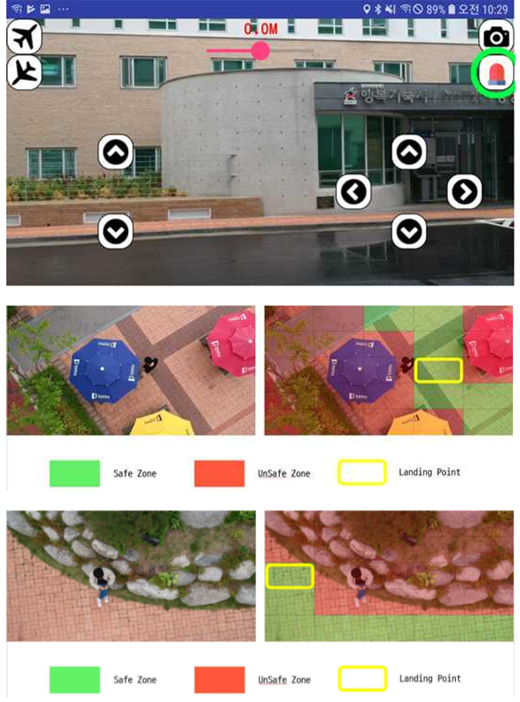

# Drone Smart Landing Solution
#### 1. Project Overview
#### 2. Build to System Environment
#### 3. Function
#### 4. Training
#### 5. Demo
#### 6. Description

<br>

## 1.Project Overview
1-1 프로젝트 정의   

- DSLS는 사용자가 드론을 안전하게 착륙시키기 어려운 환경에서 작동하는 시스템입니다. 
비행하고있는 드론의 위치에서 하단의 지면을 Image Classificaion을 통해 각 지면의 특징을 찾아내어 안전한 지역과 안전하지 않은 지역을 분류하는 시스템. 

 <br> 	

1-2 프로젝트 배경 

- 4차산업혁명으로 드론산업이 커져감에 따라 드론으로 인한 사고도 늘어나고 있습니다. 드론으로 인한 추락사고의 원인은 사용자의 부주의로 인한 비율이 가장 많은 비율을 차지하고 있다. 드론 사용자는 드론과 컨트롤러와의 연결이 끊겼거나 혹은 드론의 잔여 배터리량을 확인하지 못하여 되돌아올 수 없는 상황에서 사용자는 드론을 정확하고 안전하게 착륙해야 한다. 이러한 상황은 사용자에게는 큰 부담으로 다가오며 큰 사고로 이어질 수 있으므로 이러한 긴급 상황에서  드론 스스로 착륙지점을 판단하여 착지 할 수 있는 시스템을 고안.


 <br>	


 1-3 프로젝트 목적 

 - 1-3-1 정확한 이미지 분류를 통한 안전 착지
    - 딥러닝(Deep Learning)을 이용하여 안전 지역을 판단할 수 있는 Tensorflow 머신러닝 모델을 구축하여 학습시킨다. safe ,unsafe 두 가지의 클래스로 구분하여 지면을 탐색한다. 탐색후 가장 높은 확률의 안전 지역을 선택하도록 한다.
 
 - 1-3-2 드론 컨트롤
    - 선택된 가장 높은 확률의 안전 지역을 확인한 후 드론의 컨트롤러에 의해 제어되는 것이 아닌 드론 스스로 착륙지점으로 이동한 후에 안전하게 착륙할 수 있도록 한다. 착륙 도중 착륙지점에 문제가 생길 경우도 고려하여 착륙을 시도한다.
 
 - 1-3-3 Open Source
    - Android SDK를 지원하는 드론일 경우드론을 컨트롤하는 SDK 코드만 변경한다면 SLH ( Smart Return to Home )과 같은 기능을 제공받을 수 있다.


 
<br><br>




## 2.Build to System Environment 
2-1 Install Ubuntu 16.04

- Android Application 개발을 제외하고는 모두 Ububtu16.04 환경에서 개발


2-2 GPU 사용을 위한 Cuda, Cudnn 드라이버 설치

- CPU를 사용하여 Retraining 방식으로 학습을 할 경우 굳이 설치할 필요는 없다. 그러나 학습의 속도와 처음부터 학습을 원할경우 설치를 권장.
- Cuda & Cudnn Link : 
 (https://github.com/Deeptector/Deeptector/blob/master/document/cuda.md)


2-3  Install Anaconda (python 2.7.3)

- Anaconda 설치


2-4  Install bazel 0.5.2

- bazel설치


2-5  Install Tensorflow-gpu-1.4.0

- GPU를 사용하기 위한 설치


2-6  Install OpenCV

- OpenCV Link : (https://github.com/Deeptector/Deeptector/blob/master/document/opencv.md)

<br>


## 3.Function
- 3-1 Android SDK를 제공받는 다양한 드론 기체를 이/착륙 및 이동 제어 기능
    - 내부 구조에서 다른 SDK가 오더라도 작동할 수 있도록 구현.
<br>

- 3-2 긴급상황 시 드론 스스로 안전지대를 탐색하여 착륙 제어 기능 
  - 긴급상황 발생 시 알림 서비스
  - 안전착륙 후 드론의 착륙지점 GPS좌표 확인 서비스

- 3-3 착륙지점에 대한 정보 제공
  - 착륙지점에 대한 장소명 제공 ( 예: 잔디 , 보도블럭 , 도로 )
  
<br>

## 4.Training
4-1 Build to model
- Build a model with using the CPU or GPU  & Retraining
   ``` 
  python inceptionv3_retrain.py --image_dir  'image directory path'
   ```
 
  - 참고 : http://solarisailab.com/archives/1422
  
- Build a model with using the CPU or GPU  
  ```
     Build to model with using the GPU code 
  ```
</ul>


4-2 Convert to .tflite from .pb

 - 만들어진 Model은 .pb 파일로 생성되며 Andoird Application에서 사용하기 위해서 .tflite로 변환하여 사용. 빌드했던 OS환경은 MAC이였기에 경로지정시 유의. tensorflow root폴더 아래의 명령어 입력
```
bazel run //tensorflow/lite/toco:toco — \
—input_file= 'input_file_path'/output_graph.pb \
—output_file='output_file_path'/output_graph.tflite \
—input_format=TENSORFLOW_GRAPHDEF \
—output_format=TFLITE \
—input_shape=1,299,299,3 \
—input_array=Mul \
—output_array=final_result \
—inference_type=FLOAT \
—input_type=FLOAT
```


4-3 insert to Android 
- 변환된 모델은 Application 프로젝트 안에 assets 폴더안에 삽입.


<br>

## 5.Demo


	


<br>

## 6 .Description

- http://solarisailab.com/archives/1422
- https://github.com/Deeptector/Deeptector/blob/master/document/cuda.md
- https://github.com/Deeptector/Deeptector/blob/master/document/opencv.md

 
